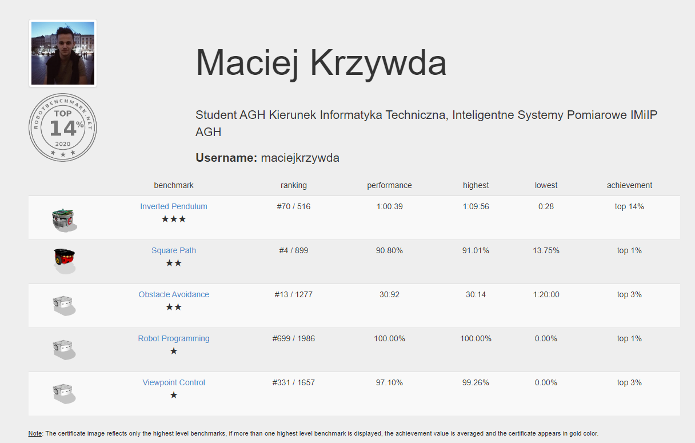

# Simulations of the Robot Environments #

### What is this repository for? ###

  
* My Solutions for [robotbenchmark](https://robotbenchmark.net/)
* Status: 17/04/2020

* [My profile at robotbenchmark.net]:(https://robotbenchmark.net/maciejkrzywda)

### Tasks (Done) ###

* Robot Programming (★) - Learn how to program a robot, save your controller program, revert and run the simulation.
* Obstacle Avoidance (★★) - Program a Thymio II robot to cross a classroom filled with obstacles as quickly as possible.
* Square Path (★★) Program a Pioneer 3-DX robot to follow a 2m x 2m square trajectory, quickly and precisely

## TO DO ## 

* Inverted Pendulum (★★★)	Program an e-puck robot to maintain an inverted pendulum up as long as possible.	
* Pick And Place (★★★) Program a youBot mobile manipulator robot to pick and place a cube as quickly as possible.	
* Pit Escape (★★★) Program a BB-8 robot lost in a sand desert to climb out of a pit as quickly as possible.	
* Wall Following (★★★) Program a Pioneer 3-DX robot to follow a random wall on its left-hand side, quickly and precisely.	
* Highway Driving (★★★★) Program a Lincoln MKZ autonomous car to drive as fast as possible on a crowded highway.