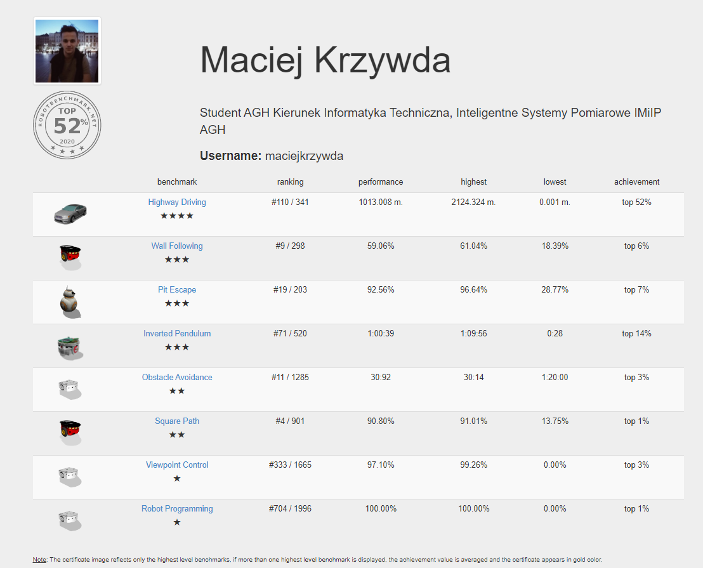

# Simulations of the Robot Environments #

### What is this repository for? ###

* My Solutions for [robotbenchmark](https://robotbenchmark.net/)
* Status: 17/04/2020

### Tasks ###

* Robot Programming (★) - Learn how to program a robot, save your controller program, revert and run the simulation.
* Obstacle Avoidance (★★) - Program a Thymio II robot to cross a classroom filled with obstacles as quickly as possible.
* Square Path ★★ Program a Pioneer 3-DX robot to follow a 2m x 2m square trajectory, quickly and precisely